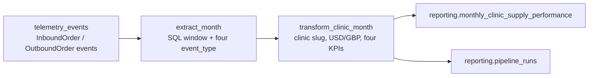

# HealthCore — Monthly Clinic Supply Performance pipeline (design)

**Status:** Implemented (Prefect 3). CLI: `python data/pipelines/pipeline.py`. Schedule: 06:00 UTC on the 1st.  
**Deliverable:** Dr. Okonkwo’s **Monthly Clinic Supply Performance Report**.  
**Sources:** [`context/06.5_PIPELINE_CONTEXT.md`](../../context/06.5_PIPELINE_CONTEXT.md), [`context/06.5_CONTEXT.md`](../../context/06.5_CONTEXT.md), live `telemetry_events`.  
**Out of scope for this design:** changing `GET /telemetry/report`, `services/api/telemetry/analysis.py`, or writing into `telemetry_events`.

This document is the contract for orchestration under `data/pipelines/`, reusable transforms under `data/process/`, and HTTP under a new **`services/reporting/`** module. In this monorepo that module is `services/api/reporting/` (same pattern as `services/api/telemetry/`). Services **import** pipeline functions. Pipelines never import FastAPI routers. Additive CONTEXT-required fields on existing `event_type`s (e.g. `unit_cost` on `inbound_order_created`) are allowed; this design does not change `GET /telemetry/report` or `telemetry/analysis.py`.

---

## 1. Current state

### 1.1 What we already capture

Backoffice `track()` emits the CONTEXT inventory floor plus platform events. FastAPI `POST /telemetry/events` appends write-only rows to public schema `telemetry_events` (same SQLModel engine / Supabase Postgres as inventory).

| `event_type` | What it is | In `tags` today (allowlisted) |
| --- | --- | --- |
| `inbound_order_created` | Vendor receipt (`InboundOrder` / `SupplyDelivery`) | `clinic_id` (1–12), `country`, `product_id`, `product_category`, `quantity`, `vendor_name`, `order_id`, `sku` |
| `outbound_order_created` | Clinical consumption (`OutboundOrder` / `SupplyConsumption`) | same clinic/product keys + `department`, `consumption_type`, `remaining_stock` |
| `stock_threshold_triggered` | Stock crossed a minimum band | clinic/product + `threshold_kind`, `threshold_value`, `trigger_order_type` |
| `supply_expiry_flagged` | Batch within 30 days of expiry | clinic/product + `expiry_date`, `days_to_expiry`, `department` |
| `direct_stock_edit_rejected` | Bypass attempt (not a KPI source for v1) | method/status/route |

`clinic_id` in telemetry is the inventory integer **1–12** (1–9 US, 10–12 UK). `country` is `US` or `UK`. `department` is a clinical area (`general_consultation`, `chronic_care`, …), never a person. No PHI keys are stored.

Envelope correlation lives in `tags` (`eventId`, `sessionId`, `userId`, `schemaVersion`, `requestId`). The table is append-only: no UPDATE/DELETE API.

### 1.2 What the technical report already answers

`GET /telemetry/report` (authenticated, 60s cache) is an **engineering** view: event volume by day/type, `level='error'` rate, `api_latency_recorded` averages, daily `login_failed` / `login_succeeded` rate. It does not produce clinic-month money, stockout counts, or expiry risk. It must stay untouched.

### 1.3 The gap

Dr. Okonkwo and Claire need a **monthly, per-clinic, per-country** rollup they can read on the first working day of the month — not raw events and not platform health.

Unanswered CONTEXT KPIs:

| KPI | Needs | Technical report? |
| --- | --- | --- |
| **Supply Cost per Clinic** | Sum of inbound **costs** for the month | No — no cost field, no clinic-month grain |
| **Supply Consumption Volume** | Count of `outbound_order_created` by clinic/month | No — volume is by `event_type`/UTC day, all clinics mixed |
| **Critical Stockout Frequency** | Count of `stock_threshold_triggered` by clinic/month | No |
| **Expiry Risk Count** | Count of `supply_expiry_flagged` by clinic/month | No |

A dedicated pipeline must read those four `event_type`s, aggregate to `clinic_id` × `month_start`, and load **`reporting.monthly_clinic_supply_performance`**. That table is not `telemetry_events` and not a generic `reporting.business_metrics`.

**Source gap to close before first production load:** `inbound_order_created` has `quantity` but no cost. CONTEXT requires a supply-cost property (`unit_cost` or `total_cost`) on that existing event — not a new `event_type`. Capture/allowlist/storage mapping must add it in the implementation part. Until then the extract can still run; `total_supply_cost` would be 0 and must not be presented as a real spend figure.

Other known limits (do not invent data): `supply_expiry_flagged` stays rare until `expiry_date` exists on `MedicalSupply`; `stock_threshold_triggered` still uses **network-wide** remaining stock with the movement’s `clinic_id` (documented in the telemetry plan).

---

## 2. Purpose (one sentence)

Produce the monthly per-clinic rollup that feeds **Dr. Okonkwo’s (and Claire’s) Monthly Clinic Supply Performance Report** on the first working day of the month, computing **Supply Cost per Clinic**, **Supply Consumption Volume**, **Critical Stockout Frequency**, and **Expiry Risk Count** from `inbound_order_created`, `outbound_order_created`, `stock_threshold_triggered`, and `supply_expiry_flagged`.

---

## 3. Extraction format and cadence

| Item | Decision |
| --- | --- |
| Source table | `public.telemetry_events` (Supabase Postgres), **read-only**. No patient tables. |
| Payload shape | Relational row + JSONB `tags`. Columns used: `timestamp timestamptz`, `event_type text`, `level text`, `value numeric` (often `quantity`), `tags jsonb` holding `clinic_id`, `country`, `product_id`, `product_category`, `quantity`, `department` (outbound/expiry only), and (to add) `unit_cost` or `total_cost` on inbound. Correlation: `eventId`. |
| How the source updates | **Insert-only** from the backoffice flush (≤20 events / 10s). Existing event rows are never patched. |
| Cadence of new data | Continuous during clinic hours; pipeline reads a closed UTC month, not the live tail. |
| Extract window | `timestamp >= month_start AND timestamp < month_start + 1 month` |
| `event_type` filter | `IN ('inbound_order_created', 'outbound_order_created', 'stock_threshold_triggered', 'supply_expiry_flagged')` — one query |
| Schedule | Prefect cron `0 6 1 * *` (06:00 UTC on the 1st) so the pack is ready the first working day; plus manual `POST /reporting/pipeline-runs` |
| Run command | `python data/pipelines/pipeline.py` (optional `--month-start YYYY-MM-DD`). From the repo root with Prefect 3 installed (`uv sync && uv run python data/pipelines/pipeline.py`). |

Raw dumps for eval/fixtures may later land in `data/raw/`; production extract always hits Postgres.

---

## 4. Data flow

```text
telemetry_events (read-only)
        │
        ▼
[extract]  SQL: month window + four event_type s
        │  DataFrame: timestamp, event_type, value, tags
        ▼
[transform]  data/process/: to_datetime UTC → clinic slug → currency
             inbound cost → four KPI columns → grain clinic × month
        │  Parquet/CSV optional under data/process/ (dev)
        ▼
[load]  upsert reporting.monthly_clinic_supply_performance
        insert reporting.pipeline_runs (execution log)
```



**Stages stay separate.** Extract does not upsert. Transform does not open HTTP. Load does not re-filter `event_type` in Python as a substitute for SQL.

### 4.1 Transform rules (HealthCore vocabulary)

CONTEXT grain: **one row per clinic per calendar month**.

| Output column | Rule |
| --- | --- |
| `clinic_id` | Text slug from telemetry integer (table below). Drop rows with unknown `tags.clinic_id` |
| `country` | `tags.country` (`US`/`UK`); must match the slug’s country |
| `month_start` | First day of `timestamp`’s UTC month (`date`) |
| `total_supply_cost` | Sum of inbound cost for that clinic/month. Cost = `tags.total_cost` if present, else `quantity × unit_cost`. Missing cost → contribute 0 and increment a transform warning counter |
| `supply_consumption_count` | Count of `outbound_order_created` |
| `critical_stockout_count` | Count of `stock_threshold_triggered` |
| `expiry_risk_count` | Count of `supply_expiry_flagged` |
| `currency` | `USD` if `country=US`, `GBP` if `UK`. **Never convert. Never sum USD+GBP into one row.** |
| `computed_at` | Load-time `now()` UTC |

v1 does **not** split consumption by `department` in the destination table (CONTEXT §4 is clinic × month). `department` stays on the event for a later drill-down; it is never a patient id.

Do not mix clinics. Do not emit a “network total” row.

### 4.2 Clinic dimension (telemetry int → reporting text)

CONTEXT destination `clinic_id` is `text`; the KPI example uses `austin-north`. Inventory/telemetry use **1–12**. Transform maps once:

| Telemetry `clinic_id` | Reporting `clinic_id` | Label | `country` | `currency` |
| --- | --- | --- | --- | --- |
| 1 | `austin-main` | Austin Main | US | USD |
| 2 | `austin-north` | Austin North | US | USD |
| 3 | `dallas-uptown` | Dallas Uptown | US | USD |
| 4 | `houston-medical-center` | Houston Medical Center | US | USD |
| 5 | `san-antonio-west` | San Antonio West | US | USD |
| 6 | `miami-brickell` | Miami Brickell | US | USD |
| 7 | `orlando-east` | Orlando East | US | USD |
| 8 | `tampa-bay` | Tampa Bay | US | USD |
| 9 | `atlanta-midtown` | Atlanta Midtown | US | USD |
| 10 | `london-city` | London City | UK | GBP |
| 11 | `london-west` | London West | UK | GBP |
| 12 | `manchester-central` | Manchester Central | UK | GBP |

Lives in `data/process/clinic_dimension.py` (or JSON next to it). Not invented third IDs.

### 4.3 Sources that update in place (vs our append-only events)

`telemetry_events` does **not** update rows. Duplicates in the **source** would be a capture bug (same `eventId` stored twice; no unique on `eventId` today). Transform **dedupes by `tags.eventId`** within the month extract so a double flush cannot double-count cost or stockouts.

The **destination** *does* update: each run recomputes a full clinic-month and **upserts** on `unique (clinic_id, month_start)`. Late inbound events in August are picked up on the next run for `month_start = 2026-08-01` by replacing that row, not inserting a second.

If a future source (e.g. inventory `supply_deliveries`) were used for cost and those rows were edited, the same rule applies: extract the month snapshot, recompute, upsert the grain. Do not incremental-add into `total_supply_cost`.

---

## 5. Destination tables (`reporting` schema)

Never write these into `public.telemetry_events`.

### 5.1 `reporting.monthly_clinic_supply_performance`

Exact CONTEXT DDL:

```sql
create table reporting.monthly_clinic_supply_performance (
  id uuid primary key default gen_random_uuid(),
  clinic_id text not null,
  country text not null,
  month_start date not null,
  total_supply_cost numeric not null default 0,
  supply_consumption_count integer not null default 0,
  critical_stockout_count integer not null default 0,
  expiry_risk_count integer not null default 0,
  currency text not null,
  computed_at timestamptz not null default now(),
  unique (clinic_id, month_start)
);
```

Idempotency key: **`(clinic_id, month_start)`**.

### 5.2 `reporting.pipeline_runs` (execution log)

Not specified in CONTEXT DDL; required for status + audit. One row per flow run. Minimum fields:

| Field | Type | Why it is necessary for audit |
| --- | --- | --- |
| `id` | `uuid` | Stable run identifier for `GET /reporting/pipeline-runs/latest` and Prefect correlation |
| `pipeline_name` | `text` | Distinguishes this job (`monthly_clinic_supply_performance`) when the table is reused |
| `month_start` | `date` | Which board month was computed — without it a failure cannot be tied to the pack |
| `started_at` | `timestamptz` | Proves whether the run finished before the first working day SLA |
| `finished_at` | `timestamptz` (null while running) | Duration and “still Running” detection |
| `status` | `text` (`running` \| `completed` \| `failed`) | Whether Okonkwo can trust the KPI query for that month |
| `records_read` | `integer` | Volume extracted from `telemetry_events`; drop vs last month is a capture-gap signal |
| `records_written` | `integer` | Clinic-month rows upserted; must not grow on an identical retry |
| `error_message` | `text` (nullable) | Why a Failed run stopped; **no PHI, emails, or raw `tags`** |
| `prefect_flow_run_id` | `text` (nullable) | Link to the orchestrator UI for the same attempt |

---

## 6. Idempotency and failed load

Mechanism: **upsert on `unique (clinic_id, month_start)`** inside **one** Postgres transaction for the KPI table. Counters are replaced, never incremented.

**Second run after a load-phase failure (concrete):**

1. Run A inserts `pipeline_runs` (`status=running`, `month_start=2026-08-01`).
2. Extract/transform succeed (e.g. 12 clinic-month rows in memory).
3. `load_clinic_month` starts `INSERT … ON CONFLICT (clinic_id, month_start) DO UPDATE`. The connection drops after some rows are sent. Because the upserts share one transaction, **none of Run A’s KPI writes commit**. `pipeline_runs` is updated to `failed` with `error_message` (best-effort; if that also fails, Prefect Failed + a stale `running` row is closed on the next start by setting it `failed`).
4. **Run B** (retry, same `month_start`): extract/transform again from `telemetry_events` (append-only, same `eventId`s → same aggregates after dedupe). Load upserts the same `(clinic_id, month_start)` keys. If Run A committed nothing, Run B inserts. If a previous **successful** run already had August rows, Run B **overwrites** those four KPI columns and `computed_at` — it does not add 340+340 consumption or duplicate `austin-north` / `2026-08-01`.
5. `records_written` on Run B equals the clinic-month cardinality (≤12), not “previous plus new”.

Do not `DELETE FROM reporting.monthly_clinic_supply_performance` for the month unless an explicit backfill flag is set. Do not `total_supply_cost = total_supply_cost + EXCLUDED.total_supply_cost`.

Clinics with **zero** events in the month: v1 **omits** them (same as the technical report’s empty days). A later backfill flow may emit zeros for all 12 clinics if Okonkwo wants a complete grid.

---

## 7. Prefect mapping

### 7.1 Main flow

**Flow:** `monthly_clinic_supply_performance`  
**Entry:** `data/pipelines/monthly_clinic_supply_performance/flow.py` → `run_monthly_clinic_supply_performance(month_start: date | None)`  
Default `month_start`: previous UTC calendar month when run on the 1st (or “month containing now−1 day” for manual mid-month refresh).

| Task | Responsibility |
| --- | --- |
| `extract_month` | SQL load of the four `event_type`s in `[month_start, next_month)` |
| `transform_clinic_month` | Dedup `eventId`, map clinic slugs, compute the four KPIs, attach `currency` |
| `load_clinic_month` | Upsert destination + finalize `pipeline_runs` |

Optional later (Part 3 subflows): extract / transform / load as subflows; a second flow `backfill_clinic_supply_performance(start_month, end_month)` looping months. Not required for Part 1.

### 7.2 States

| State | Meaning here |
| --- | --- |
| **Running** | Extract or transform in progress; `pipeline_runs.status=running` |
| **Completed** | Upsert committed; KPI query can serve that `month_start` |
| **Failed** | Exception in any task; destination transaction rolled back; `error_message` set |

No custom “Cancelled” handling in v1.

### 7.3 Blocks

| Block | Holds |
| --- | --- |
| `SqlAlchemyConnector` / Postgres block | `SUPABASE_DATABASE_URL` (psycopg3). Same database as inventory; **reporting** schema only for writes |
| Optional `Secret` | JWT not required for the worker; API trigger uses existing `JWT_SECRET` on FastAPI |

Do not store the pooler password in the repo. The worker uses the Prefect block; local `uv` runs may read `services/api/.env` the same way inventory does.

---

## 8. Application integration

New **`services/reporting/`** module (repo path `services/api/reporting/`), mounted in `app/main.py`. Separate from `services/telemetry/` / `services/api/telemetry/` and from `GET /telemetry/report`. All three routes authenticated (`get_current_user`). No Pandas or SQL for KPIs in the router — only imports from `data/pipelines/`.

| Endpoint | Role | Import from `data/pipelines/` |
| --- | --- | --- |
| `GET /reporting/monthly-clinic-supply-performance` | **KPI query** (dashboard / board pack) | `monthly_clinic_supply_performance.queries.query_monthly_clinic_supply_performance` |
| `GET /reporting/pipeline-runs/latest` | **Status query** | `monthly_clinic_supply_performance.queries.get_latest_pipeline_run` |
| `POST /reporting/pipeline-runs` | **Manual trigger** (`month_start` optional) | `monthly_clinic_supply_performance.flow.run_monthly_clinic_supply_performance` |

KPI query default `month_start` = latest month present in `reporting.monthly_clinic_supply_performance`. Manual trigger in production wraps the Prefect deployment; locally it calls the flow function. No ETL in the router.

KPI response shape (CONTEXT):

```json
{
  "month_start": "2026-07-01",
  "clinics": [
    {
      "clinic_id": "austin-north",
      "country": "US",
      "total_supply_cost": 18420.50,
      "supply_consumption_count": 340,
      "critical_stockout_count": 1,
      "expiry_risk_count": 4,
      "currency": "USD"
    }
  ]
}
```

US and UK clinics appear **side by side**. The API must not add a mixed-currency total.

### 8.1 Tree

```text
data/pipelines/monthly_clinic_supply_performance/
  flow.py              # Prefect flow + run_* entry
  extract.py
  load.py
  queries.py           # KPI + latest-run reads
  PIPELINE_DESIGN.md   # this file lives one level up
data/process/
  clinic_dimension.py
  inbound_cost.py
  clinic_month_kpis.py
services/api/reporting/
  router.py            # three endpoints only
  models.py            # Pydantic response
```

`data/eval/` later: golden clinic-month fixtures (synthetic, no PHI).

---

## 9. Privacy and constraints

- Output, logs, and eval fixtures: **no** patient id, MRN, diagnosis, email, or incident `description`.
- Aggregate at **clinic** (and later department), never person.
- Pipeline **reads** `telemetry_events` only; never writes it.
- Do not modify `GET /telemetry/report` or `telemetry/analysis.py`.
- Do not write pipeline output into `telemetry_events`.

---

## 10. Requirements scan

| Requirement | Where |
| --- | --- |
| `data/pipelines/PIPELINE_DESIGN.md` exists | this file |
| Current State + gap vs technical report | §1 |
| Extraction format (tables, shape, cadence) | §3 |
| One-sentence purpose + CONTEXT KPIs | §2 |
| No change to telemetry report; output in `reporting.*`; `services/reporting/` | intro, §5, §8–9 |
| ETL diagram with HealthCore names | §4 |
| Updates to existing records | §4.3 upsert `(clinic_id, month_start)` |
| Second run after failed load | §6 |
| Execution log ≥5 fields, type, why | §5.2 |
| One flow + three named tasks | §7.1 `monthly_clinic_supply_performance` / `extract_month` / `transform_clinic_month` / `load_clinic_month` |
| Three reporting endpoints + pipeline imports | §8 |
| Mandatory telemetry `event_type`s | §1.1, §3, §4.1 |
